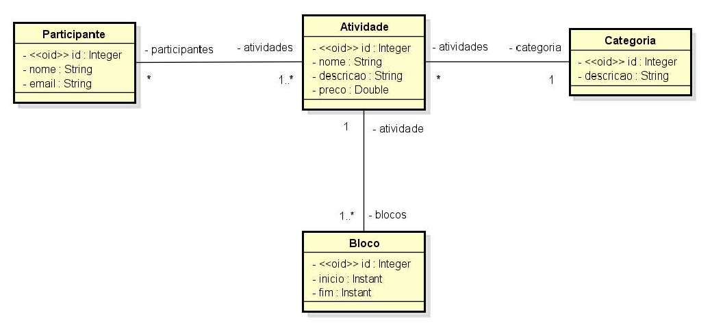
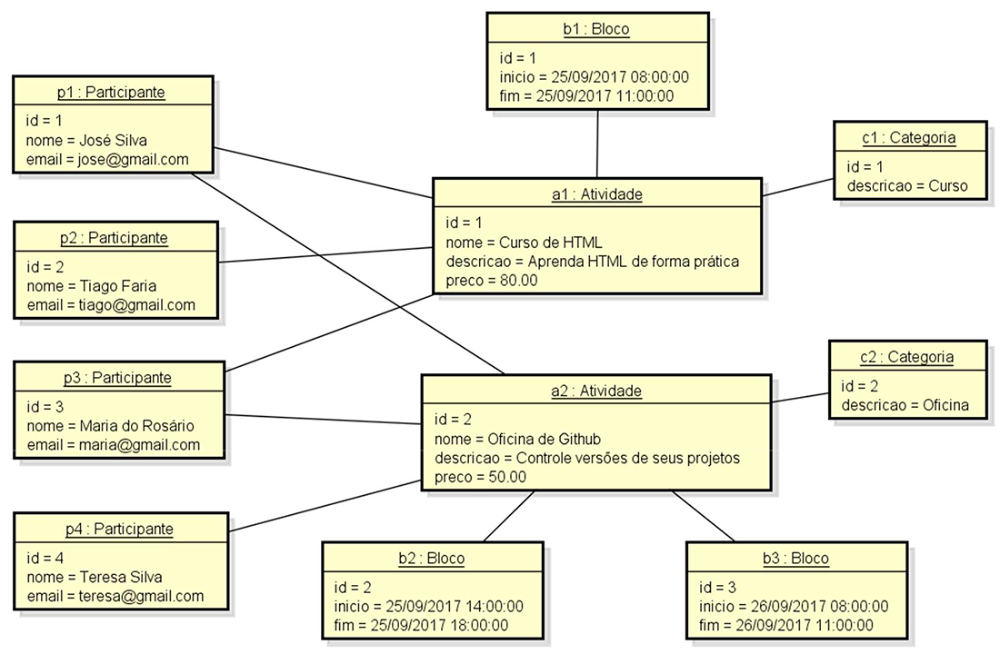

# Desafio módulo 2 - Spring: Modelo de domínio e ORM

Você deve criar um projeto no Spring Boot com Java e banco de dados H2, e implementar o modelo conceitual conforme especificação a seguir. Além disso, você deve fazer o seeding da base de dados conforme diagrama de objetos que segue.

## Fazendo o teste do projeto

O repositório do Github será clonado, e o projeto será executado localmente. O projeto deverá executar sem erros, e a base de dados deverá ser criada corretamente. O H2 Console será executado no navegador, e todas tabelas esperadas deverão ser criadas, com todos relacionamentos, e os dados do _seeding_ deverão estar presentes em cada tabela.

### Fazendo o teste do projeto

O repositório do Github será clonado pelo professor, que executará o projeto localmente. O projeto deverá executar sem erros, e a base de dados deverá ser criada corretamente. O H2 Console será executado no navegador, e todas tabelas esperadas deverão ser criadas, com todos relacionamentos, e os dados do _seeding_ deverão estar presentes em cada tabela.

###ESPECIFICAÇÃO - Sistema EVENTO:###

Construção de um sistema para gerenciar as informações dos participantes das atividades de um evento acadêmico. As atividades deste evento podem ser, por exemplo, palestras, cursos, oficinas práticas, etc. Cada atividade que ocorre possui nome, descrição, preço, e pode ser dividida em vários blocos de horários (por exemplo: um curso de HTML pode ocorrer em dois blocos, sendo necessário armazenar o dia e os horários de início de fim do bloco daquele dia). Para cada participante, deseja-se cadastrar seu nome e email.

Abaixo instância dos dados para _seeding_:

